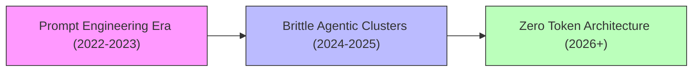
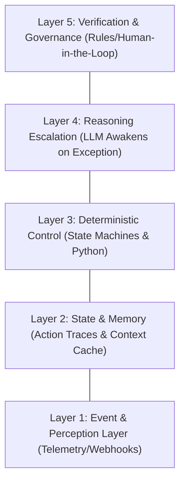

# Awesome-Zero-Token-Architecture

## Zero Token Architecture: History, Progression, Variants, & Applications

**Zero Token Architecture (ZTA)** represents a foundational paradigm shift in the software engineering, MLOps, and cost optimization of enterprise Generative AI and multi-agent systems. Coined by industry veteran Kelsey Hightower and formalised in mid-2026, ZTA establishes a design-first architectural philosophy where an AI system's boundaries, data contracts, and deterministic rules must be locked down before any interaction with a Large Language Model (LLM) occurs. 

Prior to ZTA, the early agentic ecosystem suffered from the "Weekend MVP Trap"—building applications where unstructured prompts served as the core business logic layer, leading to fragile, non-deterministic behaviors and massive, unpredictable cloud token bills. ZTA inverts this fragile pattern, establishing the principle that **the model reasons once to compile a workflow, while the system executes it forever natively**. By treating the LLM as an offline compiler rather than a permanent, metered runtime dependency, ZTA cuts the marginal cost of repeating established workflows down to exactly zero.

---

## 1. The Macro Chronological Evolution

The implementation of LLM orchestration has transitioned from brittle prompt-heavy scripts to chaotic agent state loops, shifting toward modern hyper-deterministic, state-cached, and compiled zero-token execution paths.

*   **The Unstructured Prompt Engineering Era (2022–2023)**
    *   *Concept:* The initial implementation blueprint. Developers fed massive blocks of instructions and documents into raw LLM context windows to steer behaviors.
    *   *Limitation:* Lead to highly unmaintainable systems. Modifying a core business rule required updating unstructured text strings scattered across dozens of code files, introducing severe semantic drift and hallucination vectors.
*   **The Brittle Agentic Spaghetti Era (2024–2025)**
    *   *Concept:* Introduced multi-agent frameworks (e.g., CrewAI, AutoGen) that autonomously looped calls to an LLM, allowing it to dynamically choose external tools and formulate actions at runtime.
    *   *Limitation:* Created a compounding inference cost crisis. Agents continuously burned through millions of metered tokens to "rediscover" the exact same routine procedures—such as parsing standard invoices or updating databases—leading to crippling latencies and variable execution paths.
*   **The Zero-Token Compiled Revolution (2026+)**
    *   *Concept:* Decouples cognitive planning from steady-state system execution. The AI model is treated as a localized workflow compiler. It handles initial unstructured ambiguity, outputs structured artifacts (SQL queries, State Machines, Python scripts), and then steps entirely out of the active runtime path.
    *   *Significance:* Restructures enterprise AI infrastructure. It separates predictable deterministic work from genuine cognitive logic, ensuring enterprise guardrails remain hardcoded and runtime operational costs collapse.

---

## 2. Core Functional & Conceptual Interpretations

Depending on the specific architectural layer under consideration, "Zero Token" operates across distinct operational definitions within the modern AI data stack.

*   1. The Compiled Execution Model (Strictest ZTA)
    *   **Mechanism:** The production workflow bypasses LLM inference completely during execution. The system relies natively on compiled finite state machines, explicit database drivers, rules engines, and raw application code generated once by an offline AI process.
*   2. Localized Non-Metered Processing (Zero Paid Tokens)
    *   **Mechanism:** Inputs pass through local, self-hosted processing components (such as small feature embedding models or localized intent classifiers). While mathematical tokens are processed under the hood, the enterprise incurs **zero recurring API charges** or external vendor metering fees.
*   3. The Security and Key Virtualization Variant (Agent Firewalls)
    *   **Mechanism:** Implemented in sandboxed environments like [Nilbox](https://github.com/rednakta/nilbox). It abstracts confidential API access tokens away from untrusted autonomous agents. The proxy architecture passes dummy placeholder string tokens (`KEY=KEY`) to the running agent, swaping in real backend credentials only at the absolute network call boundary to ensure zero token exposure.

---

## 3. The Functional Layer Stack (The ZERO Operating Framework)

To move production workflows away from constant token processing and into structured, persistent state, a standard ZTA deployment utilizes a strict five-layer execution model.

*   **Layer 1: Event & Perception Layer**
    *   *Function:* Monitors ambient business environments via raw webhooks, database triggers, DOM states, and system telemetry. It registers system inputs instantly without invoking active, costly AI reasoning paths.
*   **Layer 2: State & Memory Layer**
    *   *Function:* Replaces sliding context windows with permanent, structured action histories. Successful sequences of execution are logged as reusable, verified "traces," maintaining absolute context without continually replaying past logs back into an LLM.
*   **Layer 3: Deterministic Control Layer**
    *   *Function:* The primary runtime pathway. It converts manual steps into fixed rules, code scripts, and native API orchestration pipelines. If an input falls within safe operational bounds, it executes without ever touching an AI model.
*   **Layer 4: Reasoning Escalation Layer**
    *   *Function:* Keeps the LLM entirely dormant until an execution exception, schema shift, or unrecognized edge case occurs. When activated, the model evaluates the error, fixes the procedural bug, updates the compiled execution script, and returns to sleep.
*   **Layer 5: Verification & Governance Layer**
    *   *Function:* Enforces strict cryptographic integrity, output schema validations, and access controls. It ensures that any changes suggested by the Layer 4 AI compiler pass rigorous regression testing and manual approval before altering production environments.

---

## 4. Production Engineering Challenges & Mitigations

Migrating a legacy, prompt-heavy system into a clean Zero Token Architecture introduces complex state handling and synchronization overheads.

*   **The Workflow Rusting & Upstream Schema Drift Dilemma**
    *   *The Problem:* Because ZTA relies heavily on compiled, hardcoded code components generated once by an AI system, any unexpected updates to external third-party APIs or changes in incoming corporate document layouts will break the static pipeline, causing runtime failures.
    *   *Mitigation:* Implementing an **Automated Escalation Vector Loop**. When a Layer 3 script breaks, the event automatically wakes the Layer 4 LLM control plane, which dynamically reads the new API schema documentation, updates the localized Python script, and heals the pipeline autonomously.
*   **The Stateful Synchronization Latency Wall**
    *   *The Problem:* Managing persistent workflow state, long-term semantic knowledge graphs, and localized KV memory partitions across massive, distributed multi-region server clusters introduces heavy data replication latencies compared to simple, stateless API loops.
    *   *Mitigation:* Deploying **Advanced Edge-Side LM Caches** and dedicated vector state managers that partition hot user context parameters onto localized nodes, minimizing distributed database handshakes.

---

## 5. Real-World Architectural Implementations

*   **Zero-Token Log and Diagnostic Analyzers**
    *   *Application:* Instead of piping massive production log strings into an LLM cloud API daily, a ZTA compiler builds regular expressions, static analysis profiles, or linting rules once. These run locally across development branches at native machine speed for zero recurring cost.
*   **Automated Robotic Data Processing (RPA 2.0)**
    *   *Application:* Processes routine company documents like invoices and receipts. An AI inspects the layout once to build a rigid data parser. The pipeline subsequently runs standard, native Python code alongside database drivers to handle thousands of insertions without ever triggering another expensive AI model call.
*   **Hyper-Efficient Scheduled Data Ingestion Pipelines**

